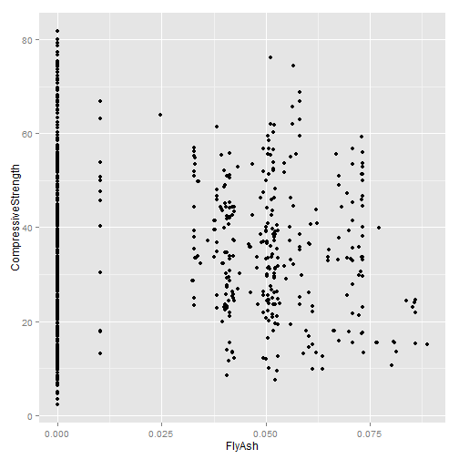

Machine Learning - Quiz 2
========================================================

Question 1
-----------

```r
library(AppliedPredictiveModeling)
library(caret)
```

```
## Loading required package: lattice
## Loading required package: ggplot2
```

```r
data(AlzheimerDisease)

adData = data.frame(diagnosis, predictors)
trainIndex = createDataPartition(diagnosis, p = 0.5, list = FALSE)
training = adData[trainIndex, ]
testing = adData[-trainIndex, ]
dim(training)
```

```
## [1] 167 131
```

```r
dim(testing)
```

```
## [1] 166 131
```


Question 2
-----------

```r
library(AppliedPredictiveModeling)
library(ggplot2)
data(concrete)
library(caret)
set.seed(975)
inTrain = createDataPartition(mixtures$CompressiveStrength, p = 3/4)[[1]]
training = mixtures[inTrain, ]
testing = mixtures[-inTrain, ]

qplot(FlyAsh, CompressiveStrength, data = training)
```

 

```r
qplot(1:nrow(training), CompressiveStrength, data = training)
```

 

```r
featurePlot(x = subset(training), y = training$CompressiveStrength, plot = "pairs")
```

 

```r
plot(1:length(training$CompressiveStrength), training$CompressiveStrength)
```

 

```r

```


Question 3
----------

```r
library(AppliedPredictiveModeling)
data(concrete)
library(caret)
set.seed(975)
inTrain = createDataPartition(mixtures$CompressiveStrength, p = 3/4)[[1]]
training = mixtures[inTrain, ]
testing = mixtures[-inTrain, ]

summary(training)
```

```
##      Cement       BlastFurnaceSlag      FlyAsh           Water       
##  Min.   :0.0448   Min.   :0.00000   Min.   :0.0000   Min.   :0.0514  
##  1st Qu.:0.0852   1st Qu.:0.00000   1st Qu.:0.0000   1st Qu.:0.0695  
##  Median :0.1148   Median :0.00879   Median :0.0000   Median :0.0786  
##  Mean   :0.1197   Mean   :0.03062   Mean   :0.0229   Mean   :0.0778  
##  3rd Qu.:0.1490   3rd Qu.:0.05956   3rd Qu.:0.0503   3rd Qu.:0.0839  
##  Max.   :0.2254   Max.   :0.15034   Max.   :0.0888   Max.   :0.1122  
##  Superplasticizer  CoarseAggregate FineAggregate        Age       
##  Min.   :0.00000   Min.   :0.346   Min.   :0.248   Min.   :  1.0  
##  1st Qu.:0.00000   1st Qu.:0.395   1st Qu.:0.311   1st Qu.:  7.0  
##  Median :0.00272   Median :0.421   Median :0.330   Median : 28.0  
##  Mean   :0.00256   Mean   :0.416   Mean   :0.330   Mean   : 46.5  
##  3rd Qu.:0.00439   3rd Qu.:0.439   3rd Qu.:0.354   3rd Qu.: 56.0  
##  Max.   :0.01315   Max.   :0.480   Max.   :0.414   Max.   :365.0  
##  CompressiveStrength
##  Min.   : 2.33      
##  1st Qu.:23.70      
##  Median :34.45      
##  Mean   :35.80      
##  3rd Qu.:46.16      
##  Max.   :81.75
```

```r

hist(training$Superplasticizer)
```

 


Question 4
----------

```r
set.seed(3433)
library(AppliedPredictiveModeling)
data(AlzheimerDisease)
adData = data.frame(diagnosis, predictors)
inTrain = createDataPartition(adData$diagnosis, p = 3/4)[[1]]
training = adData[inTrain, ]
testing = adData[-inTrain, ]

il.names <- grep("^IL", names(training), value = TRUE)
my.data <- training[, il.names]
pre.pca <- preProcess(my.data, method = "pca", thresh = 0.8)
pre.pca
```

```
## 
## Call:
## preProcess.default(x = my.data, method = "pca", thresh = 0.8)
## 
## Created from 251 samples and 12 variables
## Pre-processing: principal component signal extraction, scaled, centered 
## 
## PCA needed 7 components to capture 80 percent of the variance
```

```r

```


Question 5
----------

```r
set.seed(3433)
library(AppliedPredictiveModeling)
data(AlzheimerDisease)
adData = data.frame(diagnosis, predictors)
inTrain = createDataPartition(adData$diagnosis, p = 3/4)[[1]]
training = adData[inTrain, ]
testing = adData[-inTrain, ]

il.names <- grep("^IL", names(training), value = TRUE)

tr.data <- training[, il.names]
tr.data <- data.frame(training[, il.names], diagnosis = training$diagnosis)

ts.data <- data.frame(testing[, il.names], diagnosis = testing$diagnosis)


fit1 <- train(diagnosis ~ ., method = "glm", data = tr.data)
fit1
```

```
## Generalized Linear Model 
## 
## 251 samples
##  12 predictors
##   2 classes: 'Impaired', 'Control' 
## 
## No pre-processing
## Resampling: Bootstrapped (25 reps) 
## 
## Summary of sample sizes: 251, 251, 251, 251, 251, 251, ... 
## 
## Resampling results
## 
##   Accuracy  Kappa  Accuracy SD  Kappa SD
##   0.7       0.02   0.04         0.09    
## 
## 
```

```r

trCtrl <- trainControl(preProcOptions = list(thresh = 0.8))
fit2 <- train(diagnosis ~ ., method = "glm", preProcess = "pca", data = tr.data, 
    trControl = trCtrl)
fit2
```

```
## Generalized Linear Model 
## 
## 251 samples
##  12 predictors
##   2 classes: 'Impaired', 'Control' 
## 
## Pre-processing: principal component signal extraction, scaled, centered 
## Resampling: Bootstrapped (25 reps) 
## 
## Summary of sample sizes: 251, 251, 251, 251, 251, 251, ... 
## 
## Resampling results
## 
##   Accuracy  Kappa  Accuracy SD  Kappa SD
##   0.7       0.04   0.04         0.08    
## 
## 
```

```r

cat("Confusion Matrix of non-PCA")
```

```
## Confusion Matrix of non-PCA
```

```r
confusionMatrix(ts.data$diagnosis, predict(fit1, ts.data))
```

```
## Confusion Matrix and Statistics
## 
##           Reference
## Prediction Impaired Control
##   Impaired        2      20
##   Control         9      51
##                                         
##                Accuracy : 0.646         
##                  95% CI : (0.533, 0.749)
##     No Information Rate : 0.866         
##     P-Value [Acc > NIR] : 1.0000        
##                                         
##                   Kappa : -0.07         
##  Mcnemar's Test P-Value : 0.0633        
##                                         
##             Sensitivity : 0.1818        
##             Specificity : 0.7183        
##          Pos Pred Value : 0.0909        
##          Neg Pred Value : 0.8500        
##              Prevalence : 0.1341        
##          Detection Rate : 0.0244        
##    Detection Prevalence : 0.2683        
##       Balanced Accuracy : 0.4501        
##                                         
##        'Positive' Class : Impaired      
## 
```

```r

cat("Confusion Matrix for PCA model")
```

```
## Confusion Matrix for PCA model
```

```r
confusionMatrix(ts.data$diagnosis, predict(fit2, ts.data))
```

```
## Confusion Matrix and Statistics
## 
##           Reference
## Prediction Impaired Control
##   Impaired        3      19
##   Control         4      56
##                                         
##                Accuracy : 0.72          
##                  95% CI : (0.609, 0.813)
##     No Information Rate : 0.915         
##     P-Value [Acc > NIR] : 1.00000       
##                                         
##                   Kappa : 0.089         
##  Mcnemar's Test P-Value : 0.00351       
##                                         
##             Sensitivity : 0.4286        
##             Specificity : 0.7467        
##          Pos Pred Value : 0.1364        
##          Neg Pred Value : 0.9333        
##              Prevalence : 0.0854        
##          Detection Rate : 0.0366        
##    Detection Prevalence : 0.2683        
##       Balanced Accuracy : 0.5876        
##                                         
##        'Positive' Class : Impaired      
## 
```

